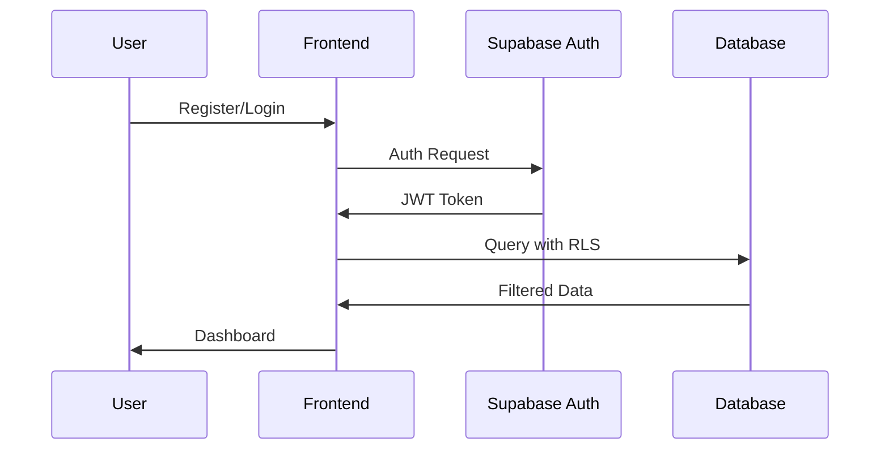
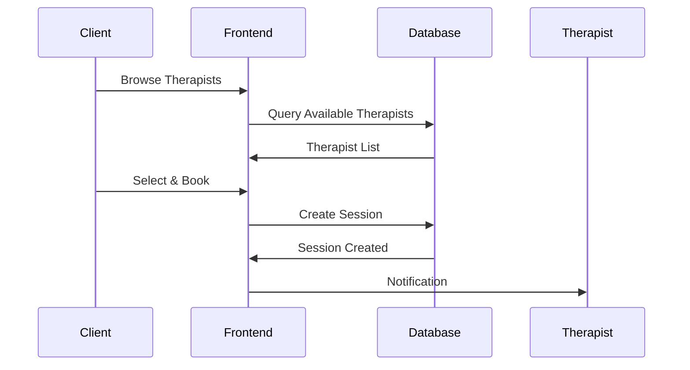

# MindLyfe Platform - Code Analysis & Developer Guide

## 📊 Executive Summary

MindLyfe is a comprehensive mental health therapy platform built with React/TypeScript frontend and Supabase backend. The platform successfully implements core therapy session management, user authentication, billing, and communication features with a robust database schema supporting multiple user roles and complex business logic.

## 🏗️ Architecture Overview

### Technology Stack
- **Frontend**: React 18, TypeScript, Tailwind CSS, shadcn/ui
- **Backend**: Supabase (PostgreSQL, Auth, Storage, Edge Functions)
- **State Management**: React Query (@tanstack/react-query), Custom hooks
- **UI Components**: Radix UI primitives with shadcn/ui styling
- **Build Tool**: Vite
- **Authentication**: Supabase Auth with Row Level Security (RLS)

### Project Structure
```
src/
├── components/          # Reusable UI components
│   ├── auth/           # Authentication forms and flows
│   ├── dashboard/      # Dashboard widgets and layouts
│   ├── sessions/       # Session management components
│   ├── booking/        # Appointment booking system
│   └── ui/             # Base UI components (shadcn/ui)
├── hooks/              # Custom React hooks
├── integrations/       # External service integrations
│   └── supabase/      # Supabase client and types
├── lib/               # Utility libraries
├── pages/             # Page components and routing
├── services/          # API service layers
├── stores/            # State management
├── types/             # TypeScript type definitions
└── utils/             # Helper functions
```

## 🗄️ Database Schema Analysis

### Core Tables Implemented

#### User Management
- **`profiles`**: Base user profiles with role-based access
- **`individual_profiles`**: Extended data for therapy clients
- **`therapist_profiles`**: Professional credentials and specializations
- **`organization_profiles`**: Company/institution accounts

#### Session Management
- **`therapy_sessions`**: Core session booking and tracking
- **`session_feedback`**: Post-session ratings and reviews
- **`therapist_availability`**: Scheduling and calendar management
- **`video_call_sessions`**: Video conferencing integration
- **`session_notes`**: Therapist session documentation
- **`session_resources`**: Educational materials per session

#### Communication
- **`messages`**: Secure client-therapist messaging
- **`notifications`**: System alerts and reminders
- **`notification_templates`**: Customizable message templates
- **`session_reminders`**: Automated appointment notifications

#### Billing & Payments
- **`subscriptions`**: Subscription plan management
- **`invoices`**: Billing and payment tracking
- **`payment_methods`**: Stored payment information
- **`payment_transactions`**: Transaction history
- **`refunds`**: Refund processing
- **`billing_history`**: Billing cycle tracking

#### Advanced Features
- **`educational_content`**: Learning resources and workshops
- **`content_categories`**: Content organization
- **`group_sessions`**: Group therapy management
- **`documents`**: File storage and management
- **`audit_logs`**: Security and compliance tracking

### Enums and Data Types
```typescript
// User roles with hierarchical permissions
user_role: 'individual' | 'therapist' | 'org_admin' | 'admin'

// Session lifecycle management
session_status: 'scheduled' | 'in_progress' | 'completed' | 'cancelled' | 'no_show'
session_type: 'virtual' | 'in_person'

// Communication preferences
communication_preference: 'email' | 'sms' | 'both'

// Organization categorization
organization_type: 'private_company' | 'school' | 'ngo' | 'government' | 'healthcare' | 'other'

// Profile verification workflow
profile_status: 'pending_review' | 'approved' | 'rejected' | 'suspended'
```

## 🔐 Security Implementation

### Row Level Security (RLS) Policies
All tables implement comprehensive RLS policies ensuring:
- Users can only access their own data
- Therapists can access assigned client sessions
- Organization admins can manage their organization's data
- System admins have appropriate elevated access

### Authentication Flow
1. **Registration**: Multi-step process with role-specific forms
2. **Email Verification**: Required for account activation
3. **Profile Completion**: Role-specific profile setup
4. **Document Upload**: Therapist credential verification
5. **Admin Approval**: Therapist account review process

## 📱 Frontend Implementation Analysis

### Component Architecture

#### Dashboard System
- **Unified Dashboard**: Role-adaptive interface (`UnifiedDashboard.tsx`)
- **Mobile Responsive**: Separate mobile layouts (`MobileDashboard.tsx`)
- **Role-Specific Views**: Individual, Therapist, Admin dashboards
- **Real-time Updates**: Supabase subscriptions for live data

#### Session Management
- **Booking System**: Multi-step therapist selection and scheduling
- **Video Integration**: WebRTC-based video calling interface
- **Session Lists**: Filterable and sortable session views
- **Calendar Integration**: Google Calendar sync capabilities

#### State Management
- **React Query**: Server state management and caching
- **Custom Hooks**: Optimized data fetching (`useOptimizedTherapists`, `useSessions`)
- **Zustand Store**: Authentication state management

### API Service Layer
```typescript
// Service structure
services/
├── api/
│   ├── sessionService.ts      # Session CRUD operations
│   ├── therapistService.ts    # Therapist-specific queries
│   └── videoCallService.ts    # Video call management
├── apiClient.ts               # HTTP client wrapper
├── calendarService.ts         # Calendar integration
└── feedbackService.ts         # Rating and review system
```

## 🚀 Implemented Features

### ✅ Core Features (Fully Implemented)
1. **User Authentication & Authorization**
   - Multi-role registration (Individual, Therapist, Organization)
   - Email verification and password reset
   - Role-based access control
   - Profile management

2. **Session Management**
   - Therapist booking system
   - Calendar integration
   - Session status tracking
   - Video call interface
   - Session feedback and ratings

3. **Communication System**
   - Secure messaging between users
   - Notification system
   - Real-time updates
   - Unread message tracking

4. **Billing & Payments**
   - Subscription management
   - Invoice generation
   - Payment processing
   - Billing history

5. **Dashboard & Analytics**
   - Role-specific dashboards
   - Session statistics
   - Revenue tracking
   - User engagement metrics

### 🔄 Advanced Features (Database Ready, UI Partial)
1. **Content Management System**
   - Educational content structure
   - Content categorization
   - Access control policies
   - *UI Implementation: Partial*

2. **Group Therapy Sessions**
   - Group session scheduling
   - Enrollment management
   - Facilitator assignment
   - *UI Implementation: Basic*

3. **Document Management**
   - File upload and storage
   - Document categorization
   - Review workflow
   - *UI Implementation: Basic*

4. **Advanced Admin Features**
   - Therapist approval workflow
   - License verification
   - Compliance tracking
   - *UI Implementation: Basic*

### 🔧 Infrastructure Features (Implemented)
1. **Security & Compliance**
   - Two-factor authentication setup
   - Audit logging
   - Data retention policies
   - GDPR compliance features

2. **Performance Optimization**
   - Database indexing
   - Query optimization
   - Caching strategies
   - Image optimization

## 📋 Development Guidelines

### Code Standards

#### TypeScript Usage
```typescript
// Always use strict typing
interface TherapistProfile {
  id: string;
  specializations: string[];
  years_experience: number;
  session_rate: number;
  bio?: string;
}

// Use database types from generated schema
import { Database } from '@/integrations/supabase/types';
type SessionStatus = Database['public']['Enums']['session_status'];
```

#### Component Structure
```typescript
// Use consistent component patterns
interface ComponentProps {
  // Props interface
}

export const Component: React.FC<ComponentProps> = ({ prop1, prop2 }) => {
  // Hooks at the top
  const [state, setState] = useState();
  const { data, loading } = useQuery();
  
  // Event handlers
  const handleAction = useCallback(() => {
    // Implementation
  }, [dependencies]);
  
  // Early returns for loading/error states
  if (loading) return <LoadingSpinner />;
  if (error) return <ErrorMessage />;
  
  // Main render
  return (
    <div className="component-container">
      {/* Component content */}
    </div>
  );
};
```

#### Data Fetching Patterns
```typescript
// Use React Query for server state
export const useTherapistSessions = (therapistId: string) => {
  return useQuery({
    queryKey: ['sessions', 'therapist', therapistId],
    queryFn: () => getSessions(therapistId),
    enabled: !!therapistId,
    staleTime: 5 * 60 * 1000, // 5 minutes
  });
};

// Implement optimistic updates
const updateSessionMutation = useMutation({
  mutationFn: updateSession,
  onMutate: async (newSession) => {
    // Optimistic update
    await queryClient.cancelQueries(['sessions']);
    const previousSessions = queryClient.getQueryData(['sessions']);
    queryClient.setQueryData(['sessions'], (old) => {
      // Update logic
    });
    return { previousSessions };
  },
  onError: (err, newSession, context) => {
    // Rollback on error
    queryClient.setQueryData(['sessions'], context.previousSessions);
  },
  onSettled: () => {
    queryClient.invalidateQueries(['sessions']);
  },
});
```

### Database Best Practices

#### Query Optimization
```sql
-- Use indexes for frequently queried columns
CREATE INDEX idx_therapy_sessions_therapist_id ON therapy_sessions(therapist_id);
CREATE INDEX idx_therapy_sessions_client_id ON therapy_sessions(client_id);
CREATE INDEX idx_therapy_sessions_scheduled_at ON therapy_sessions(scheduled_at);

-- Use composite indexes for multi-column queries
CREATE INDEX idx_sessions_therapist_status ON therapy_sessions(therapist_id, status);
```

#### RLS Policy Patterns
```sql
-- Standard user access pattern
CREATE POLICY "Users can view own data" ON table_name
  FOR SELECT USING (auth.uid() = user_id);

-- Therapist-client relationship pattern
CREATE POLICY "Therapists can view assigned sessions" ON therapy_sessions
  FOR SELECT USING (
    auth.uid() = therapist_id OR 
    auth.uid() = client_id
  );

-- Admin access pattern
CREATE POLICY "Admins can view all" ON table_name
  FOR ALL USING (
    EXISTS (
      SELECT 1 FROM profiles 
      WHERE id = auth.uid() AND role = 'admin'
    )
  );
```

### API Design Patterns

#### Service Layer Structure
```typescript
// Generic API service
export const apiService = {
  async get<T>(endpoint: string, params?: Record<string, any>): Promise<T> {
    // Implementation with error handling
  },
  
  async post<T>(endpoint: string, data: any): Promise<T> {
    // Implementation with validation
  },
  
  async put<T>(endpoint: string, data: any): Promise<T> {
    // Implementation
  },
  
  async delete(endpoint: string): Promise<void> {
    // Implementation
  }
};

// Domain-specific services
export const sessionService = {
  getSessions: (filters: SessionFilters) => 
    apiService.get('/sessions', filters),
    
  createSession: (sessionData: CreateSessionDTO) =>
    apiService.post('/sessions', sessionData),
    
  updateSession: (id: string, updates: UpdateSessionDTO) =>
    apiService.put(`/sessions/${id}`, updates),
};
```

### Testing Guidelines

#### Component Testing
```typescript
// Use React Testing Library
import { render, screen, fireEvent, waitFor } from '@testing-library/react';
import { QueryClient, QueryClientProvider } from '@tanstack/react-query';

const renderWithProviders = (component: React.ReactElement) => {
  const queryClient = new QueryClient({
    defaultOptions: {
      queries: { retry: false },
      mutations: { retry: false },
    },
  });
  
  return render(
    <QueryClientProvider client={queryClient}>
      {component}
    </QueryClientProvider>
  );
};

describe('SessionCard', () => {
  it('displays session information correctly', () => {
    const mockSession = {
      id: '1',
      title: 'Therapy Session',
      therapist: { name: 'Dr. Smith' },
      scheduled_at: '2024-01-15T10:00:00Z'
    };
    
    renderWithProviders(<SessionCard session={mockSession} />);
    
    expect(screen.getByText('Therapy Session')).toBeInTheDocument();
    expect(screen.getByText('Dr. Smith')).toBeInTheDocument();
  });
});
```

#### API Testing
```typescript
// Mock Supabase client for testing
jest.mock('@/integrations/supabase/client', () => ({
  supabase: {
    from: jest.fn(() => ({
      select: jest.fn().mockReturnThis(),
      insert: jest.fn().mockReturnThis(),
      update: jest.fn().mockReturnThis(),
      delete: jest.fn().mockReturnThis(),
      eq: jest.fn().mockReturnThis(),
      single: jest.fn().mockResolvedValue({ data: mockData, error: null }),
    })),
  },
}));
```

## 🔄 Data Flow Architecture

### Authentication Flow


### Session Booking Flow


## 🚀 Deployment & DevOps

### Environment Configuration
```bash
# Required environment variables
VITE_SUPABASE_URL=your_supabase_url
VITE_SUPABASE_ANON_KEY=your_supabase_anon_key
VITE_API_URL=your_api_url
VITE_GOOGLE_MEET_CLIENT_ID=your_google_client_id
```

### Build Process
```bash
# Development
npm run dev

# Type checking
npm run type-check

# Linting
npm run lint

# Testing
npm run test

# Production build
npm run build

# Preview production build
npm run preview
```

### Database Migrations
```bash
# Apply migrations
supabase db push

# Generate types
supabase gen types typescript --local > src/integrations/supabase/types.ts

# Reset database (development only)
supabase db reset
```

## 📈 Performance Optimization

### Frontend Optimization
1. **Code Splitting**: Implement route-based code splitting
2. **Image Optimization**: Use WebP format and lazy loading
3. **Bundle Analysis**: Regular bundle size monitoring
4. **Caching**: Implement service worker for offline support

### Database Optimization
1. **Indexing**: Strategic index creation for query performance
2. **Query Optimization**: Use EXPLAIN ANALYZE for query tuning
3. **Connection Pooling**: Implement connection pooling for high traffic
4. **Caching**: Redis caching for frequently accessed data

## 🔮 Future Development Roadmap

### Phase 1: Enhanced UI Implementation
- Complete content management system UI
- Advanced group therapy interface
- Enhanced document management
- Mobile app development

### Phase 2: Advanced Features
- AI-powered therapist matching
- Automated session notes
- Advanced analytics dashboard
- Integration with health records

### Phase 3: Scale & Performance
- Microservices architecture
- Advanced caching strategies
- Real-time collaboration features
- International expansion support

## 📞 Support & Maintenance

### Monitoring
- Application performance monitoring (APM)
- Error tracking and alerting
- Database performance monitoring
- User experience analytics

### Backup & Recovery
- Automated database backups
- Point-in-time recovery
- Disaster recovery procedures
- Data retention policies

---

*This document serves as the comprehensive guide for developers working on the MindLyfe platform. Keep it updated as the codebase evolves.*